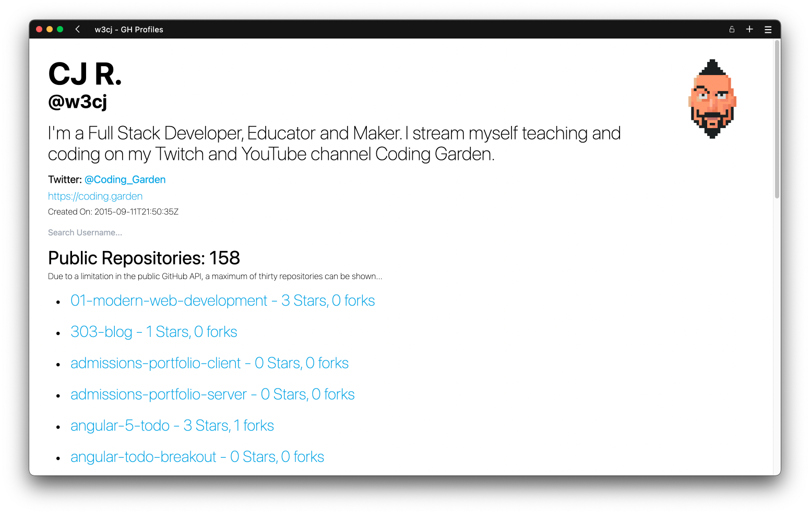
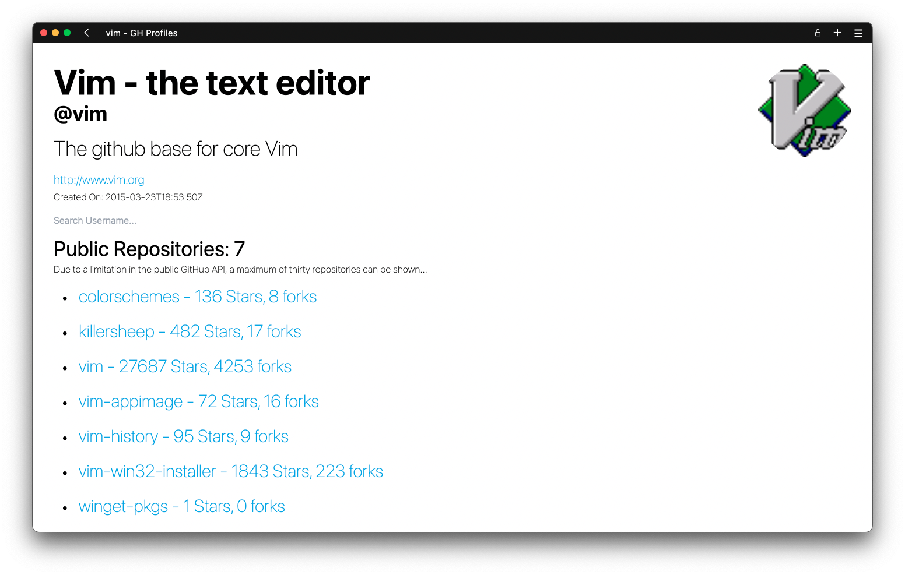

# GitHub Profile Viewer

A simple web app to view GitHub profiles made with React and Tailwind 

## Examples

Example of a user profile: 

It even works with organisations as well! 

## About

This app is available on [Heroku](example.com). The app may take sometime to start up because this dyno won’t be particularly popular, once it has started please reload the page manually to avoid any errors.

For my first proper React app, I wanted to build something simple with an API that doesn’t require an API key or OAuth. So, I decided to build a little GitHub profile viewer in React, using Tailwind for styling and Axios for API calls.

As it’s my first real project using React, I’ve decided to leave the code as-is. I will however fix any functionality breaking bugs.

You’re more than welcome to use code from this project in your own works, just please adhere to the MIT License included in this repo. 

